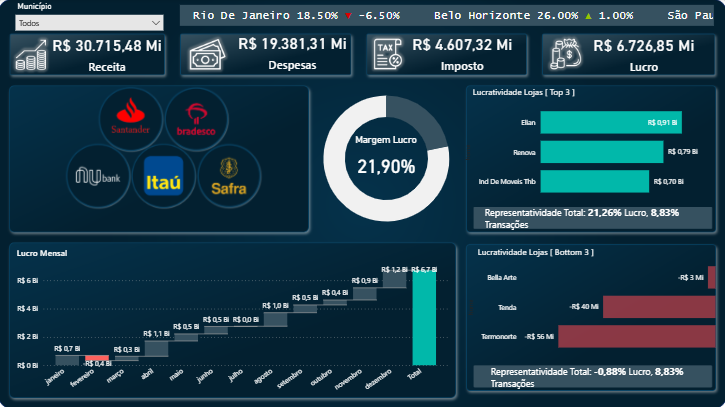

## Rede Farmáricas - Análise Margem

### Case:
Uma empresa do ramo de farmárcia tem diversas lojas como parte do negócio, em sistema de rede. A alta direção determinou um objetivo de 25% de margem de contribuição em cada Municipio, assim como mapeamento de oportunidades e riscos financeiros nessas localidades.

### Planejamento: 
1 - Levantamento da Margem de Contribuição por Município
2 - Indicadores de Lucratividade por loja separada por Município 
3 - Indicadores de Movimentação financeira por Banco 
3 - Diagnóstico através da análise de dados 
4 - Elaboração de um plano de ação voltado ao objetivo do Negócio 

  

### Diagnóstico: 
Análise baseado em 3 pilares: Lucratividade das Lojas e sua contribuição na Margem, Fluxo Financeiro por Mês e Concentração de transação por Banco. 
  - Margem/Loja: Belo Horizonte está maior 1% da meta, em contrapartida Rio de Janeiro está -6,5% e São Paulo -5%. Temos 3 Lojas com margem negativa (RJ: Termonorte e Tenda +96M e SP: 2,7M) contribuindo assim para o não objetivo de Margem. Uma observação importante está nas lojas com maior numero de Margem [Top 3] também estão nessas Regiões. 
  - Fluxo Financeiro: Fevereiro apresentou Margem Negativa [Resultado provocado pelos 2 Municípios que não alcançaram a Meta [RJ e SP] 
  - Concentração Bancária: Quanto a concentração de transações bancárias, Nubank não está entre as transações de São Paulo.

### Plano Ação Negócio 
**1 -** Aprofundamento maior nas lojas que apresentam Margem de contribuição Negativa e utilização das Lojas Top 3 como referência de desempenho 
**2 -** Ações de Marketing para estimulo de clientes com contas Nubank para compras em São Paulo - Banco e Município significativos para o Negócio 
**3 -** Campanhas em Fevereiro para minimizazar sazionalidade de Fevereiro.

## Construção Relatório Power BI

**Dataset:** 
-  Base Financeiro Modelo.xlsx (Base com as movimentações de lojas com pagamentos e recebimentos
-  Calendário: Construção de Tabela DAX com a fórmula CALENDAR (com start em 1/1/ano(min Data da Movimentação) e End 31/12/ano(min Data da Movimentação)

**Camada:**
- Staging: Para construção das Dimensões [ stgMovimentacoes ]
- Semântica: Metricas [ _Medidas_Base ]

**Modelo:**
- Star Schema [ Dimensões -> Fato com relações diretas ]

** Tabelas:**
- fMovimentações:	Fato
- dCalendario: Dim. Tempo
- dCliente: Dimensão
- dBanco: Dimensão
- dFormaPagamento: Dimensão
- dLocalidade: Dimensão
- dTipoMovimentacao: Dimensão

**Tratamento:**
- Exclusão de linhas superiores desnecessárias (rótulo de relatório)
- Utilização de primeira linha como cabeçalho
- Tipagem correta de dados
- Remoção de colunas
- Substituição de valores
 
**Métricas [_Medidas_Base]**
- Segmentação das métricas própria para fácil identificação
- Utilização de DAX como: 
  - CALCULATE: para somas contextualizadas
  - SUMX e TOPN: para soma e contagem de lojas com maior lucratividade - Top 3 e Bottom 3
  - Margem: Lucro/Receita [Lucro: Receita - Custos - Impostos]
  - Desio Meta: Margem - 0.25 [ Usado no Scroller]
 
**Visualização**
- Image Grid: Imagem como filtragem de dados
- Scroller: Texto dinâmico na parte superior
- Enligten Data Story: Texto com variáveis metrificadas
- Gráfico cascata: Fluxo de caixa
- Barras clusterizadas: Top 3 Lojas com maior lucratividade
- Gráfico Rosca: Margem

**Melhoria Futura**
- Remodelagem para arquitetura Star Schema

